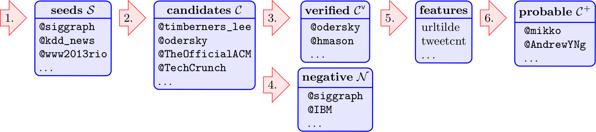

# Researchers on Twitter

This repository contains the data used in the paper
[Identifying and Analyzing Researchers on Twitter](http://www.bibsonomy.org/bibtex/2acf38d9407bfa4fdd06e82b7937daab1/jaeschke)
[[PDF](http://dx.doi.org/10.1145/2615569.2615676)].
At the moment, this includes computer scientists, though an extension to other disciplines is planned.

You can cite the data as follows:

*Asmelash Teka Hadgu and Robert Jäschke. 2014. Identifying and
Analyzing Researchers on Twitter. In Proceedings of the 6th Annual ACM
Web Science Conference (WebSci '14). 23-30. ACM, New York, NY, USA. DOI: 10.1145/2615569.2615676*

The data is also availaboe on Zenodo: 

**Please help us verifying the data** by participating in
[this survey](http://researchersontwitter.appspot.com/) and forwarding
the link to other computer scientists. It's just two questions! We
will publish the results in this repository.

## Overview

This is the processing pipeline. The data for each step is provided below.

## Seeds

We could find 170 Twitter accounts for 98 of the 268 conferences from the
[Wikipedia list of computer science conferences](http://en.wikipedia.org/wiki/List_of_computer_science_conferences):

| Area Acronym | Area                    | Conference Acronym | Conference Name | Twitter Screen Names |
| ------------ | ----------------------- | ------------------ | --------------- | -------------------- |
| AI	       | Artificial intelligence | AAMAS	          | International Conference on Autonomous Agents and Multiagent Systems |	aamas2012
| AI	       | Artificial intelligence | BMVC	              | British Machine Vision Conference |	bmvc2013, bmvc2014
| AI	       | Artificial intelligence | COLT	              | Conference on Learning Theory  |	colt2010a
| AI	       | Artificial intelligence | CVPR	              | Conference on Computer Vision and Pattern Recognition |	cvpr
| AI	       | Artificial intelligence | EACL	              | Annual Conference of the European Chapter of the Association for Computational Linguistics |	eacl2014
| ... | ... | ... | ... | ... | ... |

* [list of seeds](data/seeds.tsv)

## Candidates

We could find 52678 candidates, i.e., users which follow, retweeted,
or are followed by at least one of the seeds.

* [list of candidates](data/candidates.tsv)

## Verified Candidates

We could find a matching
[DBLP](http://www.informatik.uni-trier.de/~ley/db/) author profile for
9191 of the 52678 candidates.

| Twitter Screen Name | Real Name | DBLP URL |
| --------- | --------------- | ---------------- |
| 01Myers	    | Michael Myers	   | http://dblp.uni-trier.de/pers/hd/m/Myers:Michael.html   |
| 0xcharlie	    | Charlie Miller   | http://dblp.uni-trier.de/pers/hd/m/Miller:Charlie.html  |
| 10705013	    | Nina Jeliazkova  | http://dblp.uni-trier.de/pers/hd/j/Jeliazkova:Nina.html |
| 113134180	    | Wang Yao         | http://dblp.uni-trier.de/pers/hd/y/Yao:Wang.html        |
| 123456qwertz	| Anna Averbakh    | http://dblp.uni-trier.de/pers/hd/a/Averbakh:Anna.html   |
| ... | ... | ... |

* [list of matched candidates](data/candidates_matched.tsv)

In a manual check of a random sample of 150 matched candidates, 109
(73%) of them were correct matches, 21 (14%) of them were wrong, and
for 20 (13%) of them the experts could neither confirm nor confute the
match. Still, many of the 41 non-positive candidates turned out to be
computer scientists.

| Twitter Screen Name | Real Name | DBLP URL | Expert Judgement |
| ------------------- | --------- | ---------| :---------------:|
| 777VJ	              | Junghong Choi	|http://dblp.uni-trier.de/pers/hd/c/Choi:Junghong.html	 | :heavy_check_mark: true
| afsanehdoryab	      | Afsaneh Doryab	|http://dblp.uni-trier.de/pers/hd/d/Doryab:Afsaneh.html	 | nan
| _akira_	          | Akira Yokokawa	|http://dblp.uni-trier.de/pers/hd/y/Yokokawa:Akira.html	 | :heavy_check_mark: true
| albertobeta	      | Alberto Betella	|http://dblp.uni-trier.de/pers/hd/b/Betella:Alberto.html |	:heavy_check_mark: true
| alexander_usoro	  | Alexander James	|http://dblp.uni-trier.de/pers/hd/j/James:Alexander.html |	nan
| ... | ... | ... | ... |

* [list of verified candidates](data/candidates_verified.tsv)

## Negative Examples

| Twitter Screen Name | Real Name | Type |
| ------------------- | --------- | ---- |
| 0127Kikki	| あきひろー	| random
| 0127Syuu	| 岩崎柊	| random
| 02Ykss	| 瀬野尚子	| random
| 0308Penny	| どぅー@たいち・8・	| random
| 0555068668	| ♥عبدالرحمن بن سعود♥	| random
| ... | ... | ...

* [list of negative examples](data/negative_examples.tsv)

## Features

| Feature ID      | Type | Description |
| --------------- | ---- | ----------- |
| location.exists | Boolean | true if location exists in user profile
| has.url | Boolean | true if URL exists in user profile
| url.has.tilde |  Boolean | true if URL in user profile contains ~ (the tilde character)..
| url.has.academic.domain | Boolean | true if URL in user profile contains academic top-level domain .edu or country code second-level domain .ac (e.g., .ac.uk)
| has.bio | Boolean | true if user profile has bio
| bio.has.pattern | Boolean | true if user bio contains at least one of the keywords: architect, assistant, associate, author, candidate, co-founder, cs, designer, developer, director, engineer, fellow, founder, geek, graduate, lecturer, manager, phd, ph.d, prof, professor, programmer, researcher, scientist, senior
| language        | Boolean | true if user language is English
| default.profile.image   | Boolean | true if user has a non-default profile picture
| nof.tweets      | Numeric | number of tweets in profile
| nof.followers   | Numeric | number of followers in profile
| nof.friends     | Numeric | number of friends in profile
| friend.follower.ratio   | Numeric| nof.friends/(nof.followers ratio + 0.01)
| nof.self.tweets | Numeric | number of original tweets from the latest 3200 tweets at the time of crawl
| nof.retweets    | Numeric | number of retweets of a user from the latest 3200 tweets at the time of crawl
| retweet.tweet.ratio     | Numeric | nof.retweets to (nof.self.tweets + nof.retweets) ratio
| nof.tweets.with.url     | Numeric | number of tweets with at least one URL from the latest 3200 tweets at the time of crawl
| fraction.of.tweets.with.url     | Numeric | nof.tweets.with.url to (nof.self.tweets + nof.tweets.with.url) ratio
| nof.conf.hashtags       | Numeric | number of tweets with at least one bootstraped hashtag from the latest 3200 tweets at the time of crawl
| nof.distinct.hashtags   | Numeric | number of distinct hashtags used by the user in the latest 3200 tweets
| nof.overall.hashtags    | Numeric | number of tweets with hashtag(s) from the latest 3200 tweets at the time of crawl
| fraction.of.distinct.hashtags   | Numeric | nof.distinct.hashtags to nof.overall.hashtags ratio
| nof.conf.mentions       | Numeric | number of bootstrapped users mentioned in the latest 3200 tweets
 
* [list of features for all candidates and negative examples](data/features.tsv)
* [list of scientific hashtags](data/feature_scientific_hashtags.tsv) used for the feature *nof.conf.hashtags*
* [list of stopword hashtags](data/feature_stopword_hashtags.tsv)
  removed from the
  [list of scientific hashtags](data/feature_scientific_hashtags.tsv)
* [list of scientific terms in the bio of a user profile](data/feature_scientific_terms_bio.tsv) used for feature *bio.has.pattern*
* [list of stopword terms from the bio of a user profile](data/feature_stopwords_bio.tsv)
  removed from the
  [list of scientific terms in the bio of a user profile](data/feature_scientific_terms_bio.tsv)

## Classification

| Twitter Screen Name |	Real Name	| class | 
| --- | --- | --- | 
| 00002163	| maria guerrero parra	| researcher
| 000Foofn999	| Fofo000 000	| non-researcher
| 001101110011001	| tyo	| researcher
| 005nd	| andyr	 | researcher
| 007Natty007	| Nat	| researcher
| ... | ... | ...

* [classified candidates](candidates_classified.tsv)
